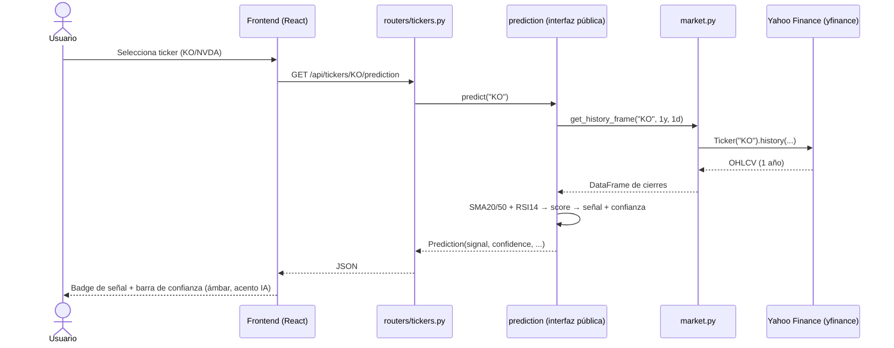

# NTI MVP — Documentación técnica

**Proyecto:** Neuronal Trading Intelligence (NTI) — Fase 3, Prácticas
Profesionalizantes, Escuela Técnica N°3 / Fref Labs.
**Fecha:** 2026-07-02.

NTI es una plataforma de apoyo a la decisión para usuarios sin experiencia
previa en inversiones. **NTI no ejecuta operaciones ni brinda asesoramiento
financiero profesional** (ERS §6.1); ese descargo es visible de forma
permanente en la interfaz.

Este MVP implementa únicamente el Resultado R2 de la Matriz de Marco Lógico
(análisis de activos + sugerencia de red neuronal), acotado a los
requerimientos RF-04, RF-06, RF-08, RF-15, RF-20, RF-21, RF-22 y RF-24 del
ERS, con exactamente dos tickers: **KO** y **NVDA**.

## Arquitectura

Arquitectura cliente-servidor simple, en un único proceso de backend (la
arquitectura distribuida del ERS — gateway y nodos de cómputo — queda
diferida a fases futuras):

```
┌────────────────────┐   HTTP /api (proxy Vite)   ┌─────────────────────────┐
│  Frontend           │ ─────────────────────────▶ │  Backend                │
│  React + Vite       │                            │  FastAPI (Python)       │
│  puerto 5173        │ ◀───────────────────────── │  puerto 8000            │
└────────────────────┘          JSON               └───────────┬─────────────┘
                                                   ┌───────────┴─────────────┐
                                                   │ SQLite (caché, TTL 5min)│
                                                   │ yfinance → Yahoo Finance│
                                                   └─────────────────────────┘
```

## Módulos del backend (`backend/app/`)

| Módulo | Responsabilidad |
| --- | --- |
| `main.py` | Punto de entrada FastAPI, CORS, registro de routers. |
| `config.py` | Tickers permitidos (KO, NVDA), rangos de gráfico, ruta de la base y TTL de caché. |
| `database.py` | Caché de respuestas en SQLite (ajuste deliberado: el ERS especifica MariaDB). |
| `market.py` | Capa de datos de mercado: cotización, histórico y fundamentals vía yfinance. Envuelve fallos del proveedor en `MarketDataError` para responder errores limpios (RNF-14). |
| `routers/tickers.py` | Endpoints HTTP y mapeo de errores (404 ticker desconocido, 422 rango inválido, 502 fallo del proveedor). |
| `prediction/` | Módulo de predicción **aislado** (ver abajo). |

### Endpoints

| Endpoint | RF | Descripción |
| --- | --- | --- |
| `GET /api/health` | — | Verificación de vida. |
| `GET /api/tickers` | — | Tickers disponibles. |
| `GET /api/tickers/{t}/quote` | RF-06 | Precio actual, variación diaria, rango del día, volumen. |
| `GET /api/tickers/{t}/chart?range=1d\|5d\|1mo\|6mo\|1y\|5y` | RF-04, RF-22 | Serie histórica OHLCV para el gráfico interactivo. |
| `GET /api/tickers/{t}/fundamentals` | RF-20 | Datos de la empresa (sector, capitalización, P/E, etc.). |
| `GET /api/tickers/{t}/prediction` | RF-08, RF-15, RF-24 | Señal comprar/mantener/vender + confianza 0-100. |

## Módulo de predicción (`backend/app/prediction/`)

Ajuste deliberado n°2: en lugar de una red neuronal TensorFlow/Keras
entrenada, un **modelo placeholder real** (heurística explicable sobre
indicadores técnicos) recorre el flujo completo de predicción de punta a
punta.

- **Interfaz pública** (lo único importable desde afuera):
  `predict(ticker: str) -> Prediction`, con `Prediction(ticker, signal,
  confidence, score, indicators, as_of)`.
- **Implementación privada** en `_engine.py`: SMA 20/50 (tendencia, peso
  0.6) + RSI 14 (momento, peso 0.4) sobre un año de cierres diarios →
  `score ∈ [-1, 1]`; `buy` si score > 0.15, `sell` si score < -0.15,
  `hold` en el resto. La fórmula de confianza está documentada en el
  docstring del módulo.
- El aislamiento está **verificado por test** (`test_prediction.py`
  escanea que ningún archivo externo importe `prediction._*`), de modo que
  el motor pueda reemplazarse por un modelo TF/Keras sin tocar a ningún
  consumidor.

### Diagrama de secuencia del flujo de predicción



## Frontend (`frontend/`)

React 18 + Vite (gestión exclusiva con `pnpm`). Componentes:

| Componente | Función |
| --- | --- |
| `App.jsx` | Estado global (ticker, rango), hook `useApiData`, layout. |
| `TopBar.jsx` | Marca, indicador Live/Offline, reloj ART en vivo. |
| `TickerRow.jsx` | Toggle KO/NVDA y selector de timeframe. |
| `PriceCard.jsx` / `PriceChart.jsx` | Precio hero, badge de variación, gráfico SVG interactivo (crosshair + tooltip al pasar el mouse). |
| `PredictionPanel.jsx` | Diagrama de red, badge Comprar/Mantener/Vender, barra de confianza segmentada (20 bloques), indicadores SMA/RSI. |

Identidad visual: "terminal financiera profesional" — monoespaciada,
escala de grises rica, y un único color de marca **ámbar/dorado reservado
exclusivamente para elementos de IA/predicción** (nunca para datos de
mercado). Los tokens viven en `frontend/src/styles/tokens.css`, extraídos
verbatim del mockup aprobado.

## Lenguajes y herramientas

| Capa | Tecnología |
| --- | --- |
| Backend | Python 3.12, FastAPI, Uvicorn, sqlite3 (stdlib), yfinance, pytest |
| Frontend | JavaScript (ES2022), React 18, Vite 6, pnpm |
| Datos | Yahoo Finance vía yfinance |
| Persistencia | SQLite (caché de respuestas) |

## Mapeo a los objetivos del proyecto

| Objetivo (MML) | Cobertura en este MVP |
| --- | --- |
| A2.1 — Integración con proveedor de datos externos | `market.py` + yfinance, con caché y manejo de fallos. |
| A2.2 — Consulta y visualización de activos | Toggle KO/NVDA + gráfico histórico interactivo. |
| A2.3 — Panel de datos relevantes del mercado | Precio actual, variación, rango del día, volumen, fundamentals. |
| A2.4 — Módulo de redes neuronales con visualización automática | Módulo `prediction/` aislado; la sugerencia se muestra automáticamente al consultar el activo. Modelo placeholder (ver informe de avance). |
| A2.5 — Términos y condiciones | Parcial: descargo ERS §6.1 permanente en la UI (sin flujo de aceptación previa, que requiere usuarios/sesión — fuera de alcance). |

Ver `docs/progress-report.md` (ajustes de alcance y diferidos) y
`docs/mml-compliance.md` (evaluación contra el IVO de R2).
